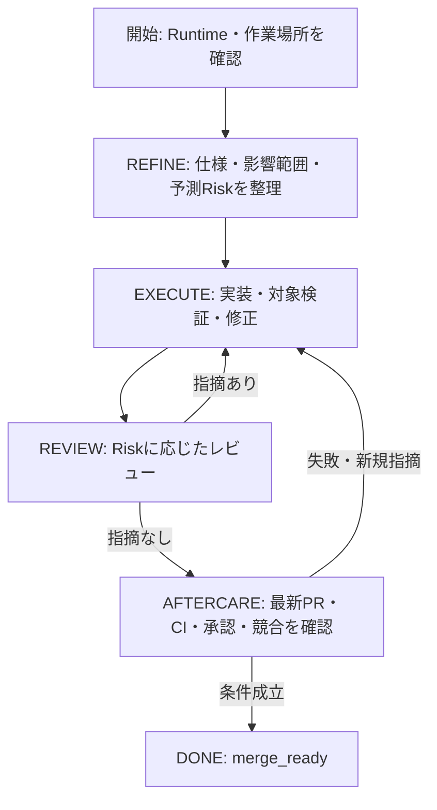

# Agent Harness軽量化

この文書を、Harnessの軽量化の設計正本とする。現行の操作手順と仕様は [Agent Harness操作手順](agent-harness.md)、State・遷移・上限値の正本は [Agent Harness State仕様](agent-harness-states.md)（`.agent/process.yaml` から自動生成）、現在の実行契約は [AGENTS.md](../AGENTS.md) と `.agent/process.yaml` を参照する。設計を記載しただけで、現在のゲートやCLIの挙動を変更したものとして扱わない。

なお、実装済みの機能差分（Profile廃止・出力縮小・証跡管理など）は [Agent Harness操作手順](agent-harness.md) が正本であり、この文書には実装状況の一覧表を持たない。

## 1. 目的と維持する条件

- Agentが読む情報、機械情報を記入する手間、検証・レビューの重複を減らし、作業時間と総トークン消費を抑える。
- Agentは仕様・実差分・検証結果の意味を判断し、CLIは状態・最低条件・証跡を管理する。
- Riskの4軸、Machine Floor、必須Skill、必須検証、独立レビュー、Human Gateを維持する。
- Stateは `REFINE / EXECUTE / REVIEW / AFTERCARE / INCIDENT / HUMAN_GATE / DONE` を使う。強度判定や個々のテストのためにStateやAgentのターンを増やさない。
- 実行契約・workflowをRuntimeごとに複製せず、必要な専門Skillだけを必要時に読む。

## 2. 全体の流れ

未決の重要な仕様判断や承認待ちはHUMAN_GATE、反復失敗や切り分けが必要な問題はINCIDENTへ進める。停止理由、復旧・承認の証跡、回数制限は現在の契約を維持する。DONEはmerge_readyを表し、マージや本番操作の許可を与えない。

## 3. 責任の分担

| 担当 | 責任 |
|---|---|
| Agent | repository調査、Goal・AC・前提・検証方針の整理、Riskの4軸と根拠、実装、結果の意味の判断 |
| CLI | 実差分の取得、Machine Floor、状態遷移、検証強度の機械判定、検証実行、証跡の生成・失効、PRとの照合 |
| Runtime adapter | Runtime固有差分の解決、適用した設定の記録 |
| Reviewer | 目的・AC・実差分・関連契約・検証を確認し、独立したRisk評価とfindingを返す |

CLIの形式検査は、Agentの判断内容やReviewerの本人性を証明しない。CLIが差分の意味を全面的に理解したものとして扱わない。

## 4. 出力と記録

- 通常の成功出力は現在State・不足条件・次の操作を中心にする。
- 設定一式、全履歴、過去の成功結果、生ログは通常出力に含めず、必要時に取得できるようにする。
- 実行契約は作業先worktreeの `AGENTS.md` を参照する。同じSession内で既読・未変更の内容を別checkoutから重複して読み込まず、契約内容が変わった場合は読み直す。
- 次の操作は保存済み状態と不足条件からCLIが生成する。Agentに毎回workflow全体を解釈し直させない。
- HEAD・base・時刻・実行コマンド・結果・状態ブロックはCLIが生成する。Agentは意味のある判断と証拠への参照を記録する。
- Human Request、Agent Spec、機械状態、証跡は分離する。Issue / PRを再開時の正本とし、ローカルGitメタデータは作業キャッシュとする。
- 新しいSessionや独立Reviewerには、その作業に必要な目的・AC・実差分・契約・証跡を渡す。詳細を省くことで必要な判断材料を欠落させない。

## 5. 検証の計画とログ

ローカルではACと直接影響する部分、browser層のACがある場合の対象E2Eを優先する。CIは広い回帰確認を担当する。検証計画は、各必須確認について実行先・対象・期待結果・証跡を持ち、Machine Floorを満たすことをCLIが検査する。

targeted / proportional / thoroughは確認範囲を決める方針とする。thoroughを、変更内容に関係なく同じfull suiteを繰り返す指定にしない。同じfull suiteをローカルとCIで重複する場合は理由を記録する。

成功時は結果の要約とログの参照先を返す。失敗時は該当箇所・失敗した確認・ログの参照先を返し、必要な詳細を追加で読めるようにする。完了時には、latest HEADに対する全必須確認を満たす。CIへ委ねた確認がpending・未観測・失敗ならDONEへ進めない。

## 6. 修正と証跡の有効性

findingの修正では、変更箇所・影響するAC・残ったfindingを再確認する。共有契約や前提が変わった場合は範囲を広げる。検証失敗やfindingを理由なく閉じない。

検証証跡の再利用は行わない（#953で撤去）。HEADまたはbaseが変わればverification証跡は全て失効し、失効の判定は実際のHEAD/base変更時に限る——遷移（findings/ci_failure等）では失効しない。この原則は「対象・依存・設定・環境・検証契約の変化で証跡を失効し、不変性を証明できない証跡を再利用しない」を、そのまま最も単純な形で実装したものである。検証強度の変更では新たに必要な確認を追加する。

レビュー証跡はlatest HEADの実差分へ結び付ける。過去のレビューを参照しても、必要な独立レビュー・最新差分の確認・全ACの照合を省略しない。

## 7. AFTERCARE

CI待ちと再取得はCLIへ集約し、状態変化やAgentの判断が必要な場合に結果を返す。latest HEAD/base、必須チェック、承認、競合、mergeability、findingの取得完了・未対応0件を照合する。

API取得失敗、pending、required check未観測、HEAD/base更新はreadyにしない。PR本文の同期でCIが再実行された場合も完了を確認する。外部writeと本番・不可逆操作の承認条件は維持する。

## 8. 実装の受入条件

- 判定のための追加State・Agent呼び出しを作らない。
- 同じ評価入力から同じ検証強度を導けることを検証できる。
- Riskの4軸・Machine Floor・必須Skill・検証・独立レビュー・Human Gateを引き下げられない。
- Runtimeへの未適用・適用未確認を、適用済みと表示しない。
- 通常出力に設定・履歴・生ログの全体を含めず、必要時には判断・再開に十分な詳細を取得できる。
- 必須確認の実行先と証跡を照合でき、CI担当の確認が終わる前にDONEへ進めない。
- 対象・依存・設定・環境・検証契約の変化で証跡を失効し、不変性を証明できない証跡を再利用しない。
- 再開、HEAD/base更新、CI再実行、反復失敗、承認待ちでも現在の完了条件を維持する。

## 9. CIと検証の分担に関する決定

- **判定はCI、検出はpush前のローカル。** 合否の正本はCIのcheck（`reviewCi` / aftercareの必須check評価）とし、ローカルは `verify:prepush`（pre-push hook）でCIと同等の失敗を早期に検出するだけに留める。ローカル証跡を合否の根拠にしない（#952・#957）。
- **CIのworkflowはパスで起動を止めず、ジョブ単位でskip（#959）。** `paths-ignore` でworkflow自体を止めるとrequired checkが未観測のまま滞留するため、workflowは常に起動し、CI scopeジョブのdiff分類で後続ジョブをskipする。SKIPPEDを合格扱いにするのはハーネス自身が `.md` のみの差分を確認できた場合に限る。
- **E2Eはジョブ専用のlocal deploymentで実行（#956）。** 共有のcloud dev deploymentは使わず、CI jobごとにanonymousのlocal backendを立てる。PR HEADのconvex関数が確実に反映され、複数PRのE2Eが相互に直列化されない。

## 10. 効果の確認

代表的な文書変更、通常のコード修正、認証・データ境界を含む高リスク変更で、同じ目的・AC・環境を使って現行と比較する。

測定対象は入力・出力トークンの合計、独立Reviewerを含む全Agentの合計、モデル呼び出し数、tool呼び出し数、所要時間、検証・CI待ち時間、修正回数とする。受入条件や必要な検証・レビューの欠落がないことも確認する。

モデル呼び出し数はユーザーとの会話往復と分けて数える。usage記録はresponse idで重複を除き、親と独立Reviewerを合算する。入力はcached/uncachedを分け、reasoningは出力の内数として二重計上しない。初期実装・指摘修正・文書更新・AFTERCAREの工程別に比較する。CLI内のpoll回数をモデル呼び出し数として数えない。

文書の文字数やCLIの出力サイズだけで、総トークンや費用が削減したと断言しない。効果は実タスクの比較結果で報告する。
