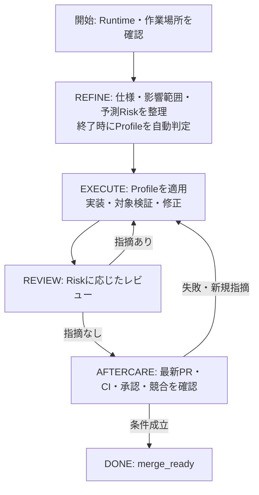

# Agent Harness軽量化とProfile自動判定

**状態: §5のProfile自動判定・§6のProfile適用（モデル・effort機構の撤去を含む）は実装済み。§2以降の出力・検証・証跡管理は段階的に実装中であり、実装済みの振る舞いは [Agent Harness操作手順](agent-harness.md) を正本とする。**

この文書を、Harnessの軽量化の設計正本とする。現行の操作手順は [Agent Harness操作手順](agent-harness.md)、現在の実行契約は [AGENTS.md](../AGENTS.md) と `.agent/process.yaml` を参照する。設計を記載しただけで、現在のゲートやCLIの挙動を変更したものとして扱わない。

## 1. 目的と維持する条件

- Agentが読む情報、機械情報を記入する手間、検証・レビューの重複を減らし、作業時間と総トークン消費を抑える。
- Agentは仕様・実差分・検証結果の意味を判断し、CLIは状態・最低条件・証跡を管理する。
- Riskの4軸、Machine Floor、必須Skill、必須検証、独立レビュー、Human Gateを維持する。Profileを安全条件の代替にしない。
- Stateは `REFINE / EXECUTE / REVIEW / AFTERCARE / INCIDENT / HUMAN_GATE / DONE` を使う。Profile判定や個々のテストのためにStateやAgentのターンを増やさない。
- 実行契約・workflowをRuntimeごとに複製せず、必要な専門Skillだけを必要時に読む。

## 2. 現行実装との差分

| 項目 | 従来のCLI | 設計・実装状況 |
|---|---|---|
| Profile選択 | ~~開始時に明示指定、モデル推奨値、既定値から選択~~ | REFINE終了時にタスク内容から自動判定（実装済み） |
| モデル・effort機構 | ~~models/でモデル推奨Profile・effort対応値を管理~~ | 機構ごと撤去（実装済み） |
| 通常出力 | ~~毎回configurationとassessmentを含むJSONを返す~~ | 現在State・不足条件・次の操作を中心に返す（実装済み） |
| 検証 | ~~必要な検証を固定コマンドで実行し、結果を返す~~ | 必須条件を満たす検証計画とartifact-firstの証跡を使う（実装済み） |
| 証跡の失効 | ~~HEADまたはbaseの更新で一括失効~~ | feature patchと検証対象treeが同一の検証だけ再利用し、その他は失効。さらにmetadata-only増分ではprocess以外の証跡を延長（いずれも実装済み。lintは `.md`+正規hook名のみ延長——詳細は `docs/agent-harness.md`） |
| 検証の往復 |  | 必須kindの個別実行に加え、`--verify-required` による直列一括実行・成功済み証跡の保持を実装済み |
| 再レビュー資料 |  | `--delta-from` で増分・前回AC証跡・全体参照を提供（実装済み）。全AC記録とfresh独立レビューを維持 |
| PR同期と観測 |  | 同一本文はwrite省略。`--check-pr` は状態を更新せずAFTERCARE/DONEを確認（実装済み）。観測を本文同期から分離 |

## 3. 全体の流れ

未決の重要な仕様判断や承認待ちはHUMAN_GATE、反復失敗や切り分けが必要な問題はINCIDENTへ進める。停止理由、復旧・承認の証跡、回数制限は現在の契約を維持する。DONEはmerge_readyを表し、マージや本番操作の許可を与えない。

## 4. 責任の分担

| 担当 | 責任 |
|---|---|
| Agent | repository調査、Goal・AC・前提・検証方針の整理、Riskの4軸と根拠、実装、結果の意味の判断 |
| CLI | 実差分の取得、Machine Floor、状態遷移、Profileの規則判定、検証実行、証跡の生成・失効、PRとの照合 |
| Runtime adapter | Runtime固有差分の解決、適用した設定の記録 |
| Reviewer | 目的・AC・実差分・関連契約・検証を確認し、独立したRisk評価とfindingを返す |

CLIの形式検査は、Agentの判断内容やReviewerの本人性を証明しない。CLIが差分の意味を全面的に理解したものとして扱わない。

## 5. Profileの自動判定

### 判定のタイミング

開始時は既定Profileを仮置きとし、ユーザーが明示指定した場合はその値を使う。

REFINEの終了条件を満たし、Goal・AC・影響範囲・Assumptions・Verification Strategy・Predicted Riskが揃った時点で、EXECUTEへ進む前にProfileを確定する。重要な未決事項が残る場合はProfileを上げて実装を強行せず、HUMAN_GATEへ進める。

### 入力と共通規則

AgentがREFINEで行う評価を再利用し、Profile選択だけの追加調査・Agent呼び出し・独立した評価書は作らない。

- 影響範囲: Risk評価の `blast_radius` を使う。
- 不確実性: Risk評価の `uncertainty` を使う。
- 検証負荷: Verification Strategyから `routine / complex` を根拠付きで評価する。複数領域の整合、複雑な状態遷移、非同期・外部境界を含む確認などはcomplexとする。

CLIは上から順に該当する規則を採用する。必要な評価値や根拠が欠ける場合は、既定値で判定を済ませずREFINEの不足条件として返す。

| Profile | 自動選択の条件 |
|---|---|
| max | `uncertainty=novel_or_impact_unclear` |
| deep | `uncertainty=some_unknowns`、`blast_radius=shared_or_system_wide`、検証負荷complexのいずれか |
| fast | `uncertainty=known_pattern` かつ `blast_radius=local` かつ検証負荷routine |
| standard | 上記以外。既知のパターンで複数箇所を扱う通常の変更など |

ユーザーの明示指定を最優先する。指定がない場合は規則で選択し、Agentが必要と判断した追加の強度は上位Profileへの変更として根拠を記録する。自動選択結果をAgentの判断だけで下位へ変更しない。

選択値、選択元、参照した評価、根拠、判定規則のバージョンを保存する。Riskの記録を複製せず参照する。T3とmaxは一対一に対応しない。例えば既知で局所的な認証変更もMachine FloorによってT3となり、Profileに関係なくT3のレビュー・検証が必要になる。

### 再判定

実装中に影響範囲、重要な前提、不確実性、検証計画が変わった場合だけ再判定する。通常の修正、テスト実行、CI待ちのたびに判定し直さない。反復失敗はINCIDENTで原因を切り分け、失敗回数だけを理由にmaxへ引き上げない。

ユーザー指定がある場合は再判定後も指定値を維持し、必要な追加検証・レビューはRiskの条件として適用する。

## 6. Profileの適用先

| 適用先 | 適用する内容 |
|---|---|
| Agent | 調査範囲、委譲方針、必要時に読む文脈の方針 |
| 検証CLI | Machine FloorとACを満たす検証に、Profileから必要な追加確認を積み上げる |

委譲は分割して進める利点がある場合に使う。aggressiveでも全タスクで別Agentを起動しない。T3、および未解決の挙動前提があるT2の独立レビューは、Profileや委譲方針にかかわらず必須とする。

## 7. 出力と記録

- 通常の成功出力は現在State・不足条件・次の操作を中心にする。Profileは確定・変更時に知らせる。
- 設定一式、全履歴、過去の成功結果、生ログは通常出力に含めず、必要時に取得できるようにする。
- 実行契約は作業先worktreeの `AGENTS.md` を参照する。同じSession内で既読・未変更の内容を別checkoutから重複して読み込まず、契約内容が変わった場合は読み直す。
- 次の操作は保存済み状態と不足条件からCLIが生成する。Agentに毎回workflow全体を解釈し直させない。
- HEAD・base・時刻・実行コマンド・結果・状態ブロックはCLIが生成する。Agentは意味のある判断と証拠への参照を記録する。
- Human Request、Agent Spec、機械状態、証跡は分離する。Issue / PRを再開時の正本とし、ローカルGitメタデータは作業キャッシュとする。
- 新しいSessionや独立Reviewerには、その作業に必要な目的・AC・実差分・契約・証跡を渡す。詳細を省くことで必要な判断材料を欠落させない。

## 8. 検証の計画とログ

ローカルではACと直接影響する部分、browser層のACがある場合の対象E2Eを優先する。CIは広い回帰確認を担当する。検証計画は、各必須確認について実行先・対象・期待結果・証跡を持ち、Machine Floorを満たすことをCLIが検査する。

targeted / proportional / thoroughは確認範囲を決める方針とする。thoroughを、変更内容に関係なく同じfull suiteを繰り返す指定にしない。同じfull suiteをローカルとCIで重複する場合は理由を記録する。

成功時は結果の要約とログの参照先を返す。失敗時は該当箇所・失敗した確認・ログの参照先を返し、必要な詳細を追加で読めるようにする。完了時には、latest HEADに対する全必須確認を満たす。CIへ委ねた確認がpending・未観測・失敗ならDONEへ進めない。

## 9. 修正と証跡の有効性

findingの修正では、変更箇所・影響するAC・残ったfindingを再確認する。共有契約や前提が変わった場合は範囲を広げる。検証失敗やfindingを理由なく閉じない。

検証証跡の再利用は、CLIが次の不変性を確認できる範囲に限定する。

- 対象内容と依存、テスト・fixture、設定、実行環境・ツールの条件が一致している。
- 影響範囲と依存の判定が可能であり、外部状態の変化など証明できない条件がない。
- 必須確認の内容や検証契約が変わっていない。

再利用時は元の実行対象・時刻・結果、不変性の根拠、再利用先を保存する。新しいHEADで再実行した結果として偽装しない。判定できない場合は失効させて再実行する。Profile変更では新たに必要な確認を追加し、有効性を証明できる既存証跡まで一括失効させない。

実装済みの再利用経路は2つある。patch+tree二重fingerprint（rebase・mergeで内容が不変な場合）と、base不変かつ増分がmetadata-onlyの場合のprocess以外への延長である。後者はkind別の入力不変性をpath集合で証明する、§9の原則に沿った限定的な入力推論である。unitの延長は「metadataを読むテストは全てprocess suite（延長不可）に所属する」という不変条件の上に成立し、guard testがそれを維持する。

レビュー証跡はlatest HEADの実差分へ結び付ける。過去のレビューを参照しても、必要な独立レビュー・最新差分の確認・全ACの照合を省略しない。

## 10. AFTERCARE

CI待ちと再取得はCLIへ集約し、状態変化やAgentの判断が必要な場合に結果を返す。latest HEAD/base、必須チェック、承認、競合、mergeability、findingの取得完了・未対応0件を照合する。

API取得失敗、pending、required check未観測、HEAD/base更新はreadyにしない。PR本文の同期でCIが再実行された場合も完了を確認する。外部writeと本番・不可逆操作の承認条件は維持する。

## 11. 実装の受入条件

- REFINEの終了条件を満たす前に自動Profileを確定せず、判定のための追加State・Agent呼び出しを作らない。
- 同じ評価入力から同じProfileを選び、明示指定、未知モデル、再判定の条件を検証できる。
- 全ProfileでRiskの4軸・Machine Floor・必須Skill・検証・独立レビュー・Human Gateを引き下げられない。
- Runtimeへの未適用・適用未確認を、適用済みと表示しない。
- 通常出力に設定・履歴・生ログの全体を含めず、必要時には判断・再開に十分な詳細を取得できる。
- 必須確認の実行先と証跡を照合でき、CI担当の確認が終わる前にDONEへ進めない。
- 対象・依存・設定・環境・検証契約の変化で証跡を失効し、不変性を証明できない証跡を再利用しない。
- 再開、HEAD/base更新、CI再実行、反復失敗、承認待ちでも現在の完了条件を維持する。

## 12. 効果の確認

代表的な文書変更、通常のコード修正、認証・データ境界を含む高リスク変更で、同じ目的・AC・環境を使って現行と比較する。

測定対象は入力・出力トークンの合計、独立Reviewerを含む全Agentの合計、モデル呼び出し数、tool呼び出し数、所要時間、検証・CI待ち時間、修正回数とする。受入条件や必要な検証・レビューの欠落がないことも確認する。

モデル呼び出し数はユーザーとの会話往復と分けて数える。usage記録はresponse idで重複を除き、親と独立Reviewerを合算する。入力はcached/uncachedを分け、reasoningは出力の内数として二重計上しない。初期実装・指摘修正・文書更新・AFTERCAREの工程別に比較する。CLI内のpoll回数をモデル呼び出し数として数えない。

文書の文字数やCLIの出力サイズだけで、総トークンや費用が削減したと断言しない。効果は実タスクの比較結果で報告する。
