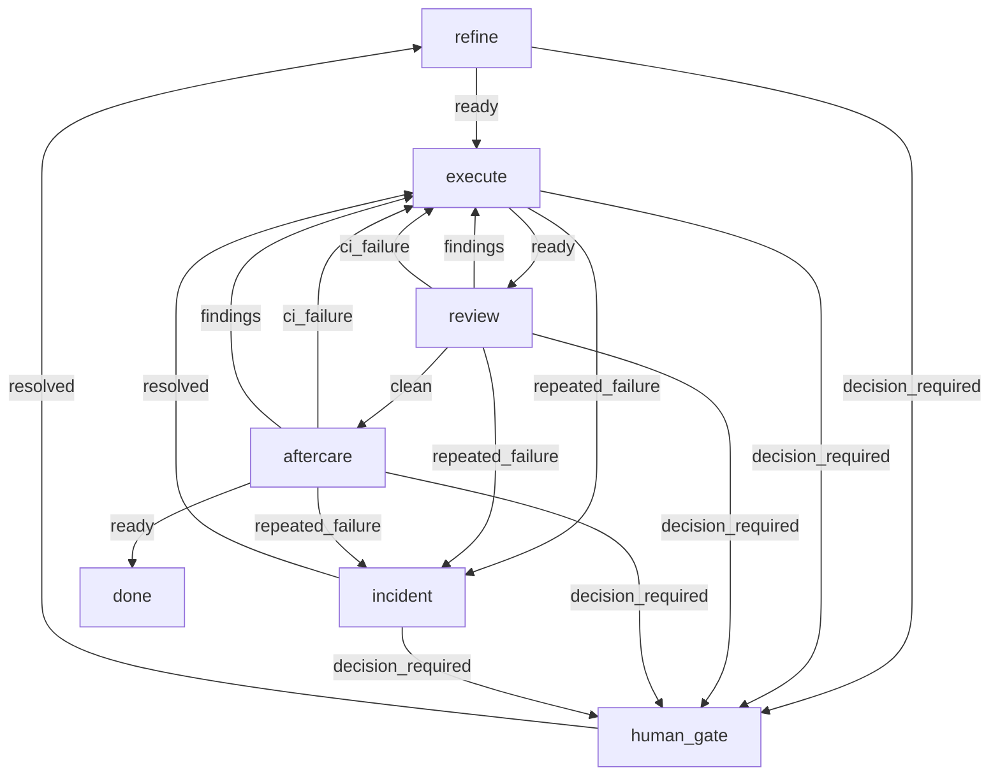

# Agent Harness State仕様

> このファイルは `.agent/process.yaml` から `node scripts/generate-harness-docs.mjs` で自動生成する。直接編集しない。State名・イベント名・上限値の正本は process.yaml のみ。

initial state: `refine`

## States

| State | workflow | terminal |
|---|---|---|
| refine | `.agent/workflow/refine.md` | - |
| execute | `.agent/workflow/execute.md` | - |
| review | `.agent/workflow/review.md` | - |
| aftercare | `.agent/workflow/aftercare.md` | - |
| incident | `.agent/workflow/incident.md` | - |
| human_gate | - | - |
| done | - | yes |

## 遷移

| State | event | 遷移先 |
|---|---|---|
| refine | ready | execute |
| refine | decision_required | human_gate |
| execute | ready | review |
| execute | repeated_failure | incident |
| execute | decision_required | human_gate |
| review | clean | aftercare |
| review | findings | execute |
| review | ci_failure | execute |
| review | repeated_failure | incident |
| review | decision_required | human_gate |
| aftercare | ready | done |
| aftercare | ci_failure | execute |
| aftercare | findings | execute |
| aftercare | repeated_failure | incident |
| aftercare | decision_required | human_gate |
| incident | resolved | execute |
| incident | decision_required | human_gate |
| human_gate | resolved | refine |

## Limits

| key | value |
|---|---|
| same_failure_max | 3 |
| review_reassess_every | 2 |
| review_max_rounds | 5 |
| ci_fix_max_rounds | 3 |

## Flow

